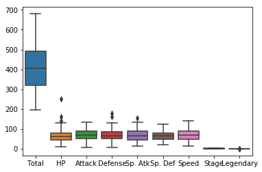
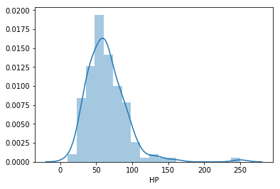
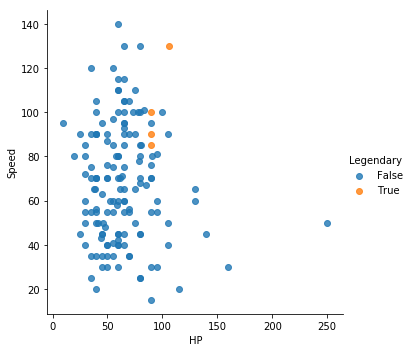
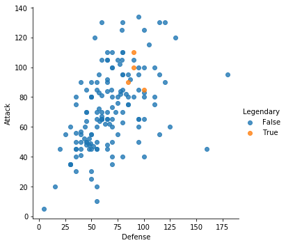
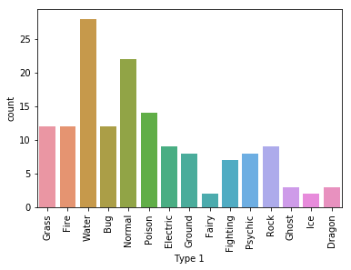
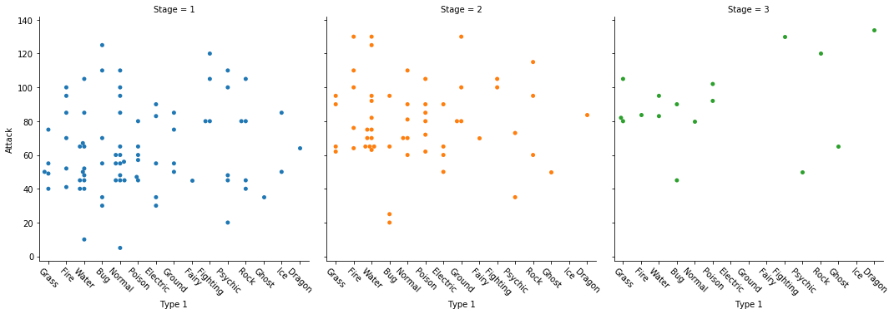

#  Seaborn Tutorial

This is a basic demonstration of the Seaborn Python data visualization library. Prior to running this tutorial it is best to have the Seaborn documentation, in case if you want to learn more about Seaborn. For this demonstration, I will be using the Pokemon first generation data to run the tutorial.

http://seaborn.pydata.org/api.html
For those who want to list to the original Pokémon theme song
https://www.youtube.com/watch?v=rg6CiPI6h2g


```python
import pandas as pd
from matplotlib import pyplot as plt
import seaborn as sns
from IPython.display import HTML
```


```python
# Read dataset
#l rather than using encoding latin-1
df = pd.read_csv('Pokemon.csv', index_col=0, encoding = "latin-1")#encoding = "ISO-8859-1")
```


```python
print(df)
```

               Name    Type 1   Type 2  Total   HP  Attack  Defense  Sp. Atk  \
    #                                                                          
    1     Bulbasaur     Grass   Poison    318   45      49       49       65   
    2       Ivysaur     Grass   Poison    405   60      62       63       80   
    3      Venusaur     Grass   Poison    525   80      82       83      100   
    4    Charmander      Fire      NaN    309   39      52       43       60   
    5    Charmeleon      Fire      NaN    405   58      64       58       80   
    6     Charizard      Fire   Flying    534   78      84       78      109   
    7      Squirtle     Water      NaN    314   44      48       65       50   
    8     Wartortle     Water      NaN    405   59      63       80       65   
    9     Blastoise     Water      NaN    530   79      83      100       85   
    10     Caterpie       Bug      NaN    195   45      30       35       20   
    11      Metapod       Bug      NaN    205   50      20       55       25   
    12   Butterfree       Bug   Flying    395   60      45       50       90   
    13       Weedle       Bug   Poison    195   40      35       30       20   
    14       Kakuna       Bug   Poison    205   45      25       50       25   
    15     Beedrill       Bug   Poison    395   65      90       40       45   
    16       Pidgey    Normal   Flying    251   40      45       40       35   
    17    Pidgeotto    Normal   Flying    349   63      60       55       50   
    18      Pidgeot    Normal   Flying    479   83      80       75       70   
    19      Rattata    Normal      NaN    253   30      56       35       25   
    20     Raticate    Normal      NaN    413   55      81       60       50   
    21      Spearow    Normal   Flying    262   40      60       30       31   
    22       Fearow    Normal   Flying    442   65      90       65       61   
    23        Ekans    Poison      NaN    288   35      60       44       40   
    24        Arbok    Poison      NaN    438   60      85       69       65   
    25      Pikachu  Electric      NaN    320   35      55       40       50   
    26       Raichu  Electric      NaN    485   60      90       55       90   
    27    Sandshrew    Ground      NaN    300   50      75       85       20   
    28    Sandslash    Ground      NaN    450   75     100      110       45   
    29   Nidoran‰ªÛ    Poison      NaN    275   55      47       52       40   
    30     Nidorina    Poison      NaN    365   70      62       67       55   
    ..          ...       ...      ...    ...  ...     ...      ...      ...   
    122    Mr. Mime   Psychic    Fairy    460   40      45       65      100   
    123     Scyther       Bug   Flying    500   70     110       80       55   
    124        Jynx       Ice  Psychic    455   65      50       35      115   
    125  Electabuzz  Electric      NaN    490   65      83       57       95   
    126      Magmar      Fire      NaN    495   65      95       57      100   
    127      Pinsir       Bug      NaN    500   65     125      100       55   
    128      Tauros    Normal      NaN    490   75     100       95       40   
    129    Magikarp     Water      NaN    200   20      10       55       15   
    130    Gyarados     Water   Flying    540   95     125       79       60   
    131      Lapras     Water      Ice    535  130      85       80       85   
    132       Ditto    Normal      NaN    288   48      48       48       48   
    133       Eevee    Normal      NaN    325   55      55       50       45   
    134    Vaporeon     Water      NaN    525  130      65       60      110   
    135     Jolteon  Electric      NaN    525   65      65       60      110   
    136     Flareon      Fire      NaN    525   65     130       60       95   
    137     Porygon    Normal      NaN    395   65      60       70       85   
    138     Omanyte      Rock    Water    355   35      40      100       90   
    139     Omastar      Rock    Water    495   70      60      125      115   
    140      Kabuto      Rock    Water    355   30      80       90       55   
    141    Kabutops      Rock    Water    495   60     115      105       65   
    142  Aerodactyl      Rock   Flying    515   80     105       65       60   
    143     Snorlax    Normal      NaN    540  160     110       65       65   
    144    Articuno       Ice   Flying    580   90      85      100       95   
    145      Zapdos  Electric   Flying    580   90      90       85      125   
    146     Moltres      Fire   Flying    580   90     100       90      125   
    147     Dratini    Dragon      NaN    300   41      64       45       50   
    148   Dragonair    Dragon      NaN    420   61      84       65       70   
    149   Dragonite    Dragon   Flying    600   91     134       95      100   
    150      Mewtwo   Psychic      NaN    680  106     110       90      154   
    151         Mew   Psychic      NaN    600  100     100      100      100   
    
         Sp. Def  Speed  Stage  Legendary  
    #                                      
    1         65     45      1      False  
    2         80     60      2      False  
    3        100     80      3      False  
    4         50     65      1      False  
    5         65     80      2      False  
    6         85    100      3      False  
    7         64     43      1      False  
    8         80     58      2      False  
    9        105     78      3      False  
    10        20     45      1      False  
    11        25     30      2      False  
    12        80     70      3      False  
    13        20     50      1      False  
    14        25     35      2      False  
    15        80     75      3      False  
    16        35     56      1      False  
    17        50     71      2      False  
    18        70    101      3      False  
    19        35     72      1      False  
    20        70     97      2      False  
    21        31     70      1      False  
    22        61    100      2      False  
    23        54     55      1      False  
    24        79     80      2      False  
    25        50     90      1      False  
    26        80    110      2      False  
    27        30     40      1      False  
    28        55     65      2      False  
    29        40     41      1      False  
    30        55     56      2      False  
    ..       ...    ...    ...        ...  
    122      120     90      1      False  
    123       80    105      1      False  
    124       95     95      1      False  
    125       85    105      1      False  
    126       85     93      1      False  
    127       70     85      1      False  
    128       70    110      1      False  
    129       20     80      1      False  
    130      100     81      2      False  
    131       95     60      1      False  
    132       48     48      1      False  
    133       65     55      1      False  
    134       95     65      2      False  
    135       95    130      2      False  
    136      110     65      2      False  
    137       75     40      1      False  
    138       55     35      1      False  
    139       70     55      2      False  
    140       45     55      1      False  
    141       70     80      2      False  
    142       75    130      1      False  
    143      110     30      1      False  
    144      125     85      1       True  
    145       90    100      1       True  
    146       85     90      1       True  
    147       50     50      1      False  
    148       70     70      2      False  
    149      100     80      3      False  
    150       90    130      1       True  
    151      100    100      1      False  
    
    [151 rows x 12 columns]


```python
#Boxplot with the Pokémon's combat statistics
sns.boxplot(data=df)
```


    <matplotlib.axes._subplots.AxesSubplot at 0x1a1ba64d30>





```python
#Dropping the unnecessary variables 
new_df = df.drop(['Total', 'Sp. Atk', 'Sp. Def', 'Stage', 'Legendary'], axis=1)
```


```python
#A cleaned up boxplot
sns.boxplot(data=new_df)
```


    <matplotlib.axes._subplots.AxesSubplot at 0x1a1be4f940>


```python
#The second plot is about the histrograms demonstrating distribution of HP (Health Points)
sns.distplot(df.HP)
```


    <matplotlib.axes._subplots.AxesSubplot at 0x1a1bf432e8>





```python
#The third plot is scatter plot looking at Health Points and Speed
# Scatterplot arguments
sns.lmplot(x='HP', y='Speed', data=df,
           fit_reg=False, # No regression line
           hue='Legendary')   # Color by LEGENDARY stage
```


    <seaborn.axisgrid.FacetGrid at 0x1a1c03ce10>





```python
# Scatterplot arguments
sns.lmplot(x='Defense', y='Attack', data=df,
           fit_reg=False, # No regression line
           hue='Legendary')   # Color by LEGENDARY stage
```


    <seaborn.axisgrid.FacetGrid at 0x1a1c0e8ba8>





```python
#Barplot
#Distribution of the categorical data 
#Looking at the different kinds of Pokemon 
#i.e. (Water, Fire, Electric, Fire, Ice, Rock, Ground, Poison, and so forth)

#Barplot
sns.countplot(x='Type 1', data=df)
plt.xticks(rotation=90)

```


    (array([ 0,  1,  2,  3,  4,  5,  6,  7,  8,  9, 10, 11, 12, 13, 14]),
     <a list of 15 Text xticklabel objects>)





```python

# Factor Plot
g = sns.factorplot(x='Type 1', 
                   y='Attack', 
                   data=df, 
                   hue='Stage',  # Color by stage
                   col='Stage',  # Separate by stage
                   kind='swarm') # Swarmplot
 
# Rotate x-axis labels
g.set_xticklabels(rotation=-45)
 
# Doesn't work because only rotates last plot
# plt.xticks(rotation=-45)


```

    /Users/wuonseokchoi/anaconda3/lib/python3.7/site-packages/seaborn/categorical.py:3666: UserWarning: The `factorplot` function has been renamed to `catplot`. The original name will be removed in a future release. Please update your code. Note that the default `kind` in `factorplot` (`'point'`) has changed `'strip'` in `catplot`.
      warnings.warn(msg)


    <seaborn.axisgrid.FacetGrid at 0x1a1c46de10>





```python

```
